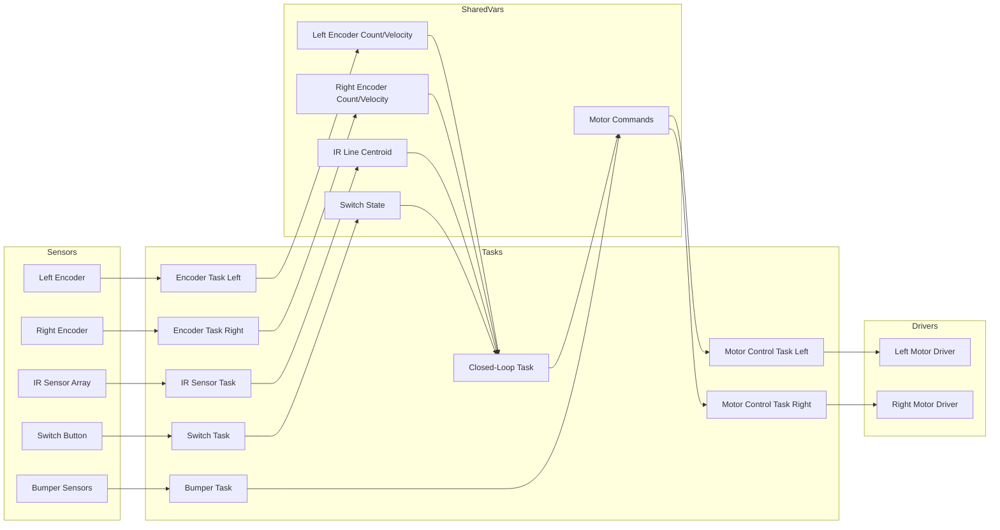
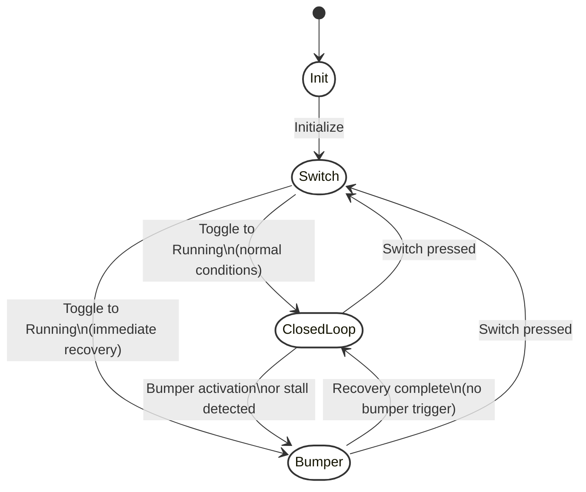

# ME 405 Term Project

Welcome to our ME 405 Term Project repository! We are **Lukas Moreau** and **Patrick Michael**, and this project documents our journey in designing, building, and programming an autonomous Romi robot for a time-trial challenge.  

Our Romi robot integrates multiple subsystems, including:  
- **Motor and Encoder Drivers** for precise wheel control and odometry.  
- **IR Sensor Array** for line following with calibrated readings.  
- **Bumper Sensors** to detect collisions and trigger recovery maneuvers.  
- **Closed-Loop Control** using a PID-based system for accurate path correction.  
- **Task-Based Multitasking** for efficient coordination between system components.  

   

This repository includes our full **codebase**, **circuit diagrams**, **state machine logic**, and **test results**. Below, you’ll find a structured breakdown of our implementation, challenges, and optimizations.  

## Table of Contents
- [Required Parts and Materials](#required-parts-and-materials)
- [Miscellaneous Components](#miscellaneous-components)
- [Tools Required](#tools-required)
- [Romi Assembly](#romi-assembly)
- [Wiring Diagram](#wiring-diagram)
- [The Challenge](#the-challenge)
- [What's Unique about Our Design?](#whats-unique-about-our-design)
- [System Overview](#system-overview)
- [IR Centroid and PID Calculations and explanation](IR-Centroid-and-PID-Calculations-and-explanation)
- [Kinematics of the Romi Robot](Kinematics-of-the-Romi-Robot)
- [Task Diagram & Descriptions](#task-diagram--descriptions)
  - [Task Diagram](Task-Diagram)
- [Finite State Machines (FSMs)](#finite-state-machines-fsms)
  - [Closed-Loop Task FSM](#closed-loop-task-fsm-line-following-sections)
  - [Bumper Task FSM](#bumper-task-fsm-backup-maneuver)
  - [Switch Task FSM](#switch-task-fsm-operational-state-toggle)
  - [Mastermind FSM](Mastermind)
- [Using Our Code](#using-our-code)
- [Conclusion and Results](#conclusion-and-Results)

## Required Parts and Materials

> **Note:** The following tables are taken from the **ME 405 Lab Manuals** provided by Professor Charlie Refvem throughout the Winter quarter of 2025 at the California Polytechnic State University in San Luis Obispo.

| Quantity | Item                                    | Purchase Link |
|----------|-----------------------------------------|--------------|
| 1x       | 120pcs 20cm Dupont Ribbon             | [Amazon](https://www.amazon.com/dp/B07GCY6CH7) |
| 1x       | HC-05 Bluetooth Module                | [Amazon](https://www.amazon.com/dp/B01MQKX7VP) |
| 6x       | NiMH AA Battery                        | [Amazon](https://www.amazon.com/dp/B0D2JCY87L) |
| 1x       | NiMH Battery Charger                   | [Amazon](https://www.amazon.com/dp/B00JHKSLM8) |
| 2x       | 1x6 Pin Dupont Housing                 | [Pololu](https://www.pololu.com/product/1905) |
| 2x       | 2x6 Pin Dupont Housing                 | [Pololu](https://www.pololu.com/product/1914) |
| 2x       | 2x13 Pin Dupont Housing                | [Pololu](https://www.pololu.com/product/1969) |
| 1x       | IR Reflectance Sensors                 | [Pololu](https://www.pololu.com/category/123) |
| 1x       | USB-Mini-B to USB-C Cable              | [Amazon](https://www.amazon.com/dp/B082F3M1HW) |
| -        | Heat Shrink Tubing                     | [Amazon](https://www.amazon.com/dp/B01MFA3OFA) |

## Miscellaneous Components

| Quantity | Component                              |
|----------|----------------------------------------|
| 4x       | M2.5 x 8mm Standoff                    |
| 4x       | M2.5 x 10mm Standoff                   |
| 4x       | M2.5 x 30mm Standoff                   |
| 4x       | M2.5 x 6mm Socket Head Cap Screw       |
| 4x       | M2.5 x 8mm Socket Head Cap Screw       |
| 4x       | M2.5 x 10mm Socket Head Cap Screw      |
| 8x       | M2.5 Nylon Lock Nuts                   |
| 8x       | M2.5 Nylon Washer                      |
| 1x       | Acrylic Romi-to-Shoe Adapter           |
| 1x       | BNO055 IMU Breakout Board              |
| 1x       | Modified Shoe of Brian                 |
| 1x       | Extra Nucleo L476RG                    |
| 1x       | Romi Chassis w/ Wheels and Casters     |

## Tools Required

| Tool                                          |
|-----------------------------------------------|
| 2mm Hex Driver (for M2.5 SHCS)               |
| 5mm Nut Driver (for M2.5 Nuts)               |
| Small Adjustable Wrench or Parallel Pliers   |
| Slotted/Flat Blade Screwdriver or Small Pry Bar |

## Romi Assembly
> **Note:** The following manual is taken from the **ME 405 Lab Manuals** provided by Professor Charlie Refvem throughout the Winter quarter of 2025 at the California Polytechnic State University in San Luis Obispo.
**[Download ME 405 Term Project Manual (PDF)](https://github.com/Lukas9293/ME405TermProject/blob/main/ME405_2252_Term_Project_0x01%20(3).pdf)**
## Wiring Diagram

Our wiring approach assigns distinct microcontroller pins to each subsystem to ensure clear, organized connections. The left and right motors each receive a PWM signal (pins A9 and B1, respectively) and a direction pin (C7 for left, B15 for right), with additional sleep/enable pins (B6 for left, B2 for right) controlling power states. Quadrature encoders attach to dedicated timer channels—left encoder on A15 and B3 (Timer 2), right encoder on A0 and A1 (Timer 5)—providing both cumulative position and velocity data. An eight-channel IR sensor array spans analog pins PC4, PA5, PC5, PA6, PB0, PC1, PA4, and PC0, enabling precise centroid calculations for line-following. Three active-low bumper sensors on each side feed into digital inputs (PB13, PB14, PB4 for left; PB7, PC2, PC3 for right), detecting collisions or misalignments. Although a BNO055 IMU is included on the board, our current design does not use its outputs, focusing instead on IR-based line tracking and bumper feedback for dynamic maneuvering. All components are grounded, and power is distributed appropriately to ensure stable operation across motors, encoders, and sensors.

## The Challenge

Our robot had to autonomously navigate a complex race track that featured multiple checkpoints, a start/finish line, a wall, and a structure outlined in the grid. The challenge was set up as a time trial where hitting each checkpoint in sequence was essential, and strategically placed cups offered a bonus—knocking a cup over would subtract 5 seconds from our total time. Our goal was to secure the bonus from both cups and get to the finish line as fast as possible. In addition to these elements, the structure on the track required the robot to precisely maneuver through various turns and corridors, adding an extra layer of difficulty to the competition.

## What's Unique about Our Design?

Our main code is designed to integrate multiple sensor inputs and control strategies into a single cohesive system. At its core, the closed-loop task uses a PID controller that compares the IR sensor’s weighted centroid to a desired setpoint (typically 0.5, indicating a centered line). The error computed—setpoint minus the filtered sensor reading—is then scaled by a proportional gain (kp) and, where needed, supplemented with integral and derivative terms. A crucial part of this process is the use of a low-pass filter controlled by the variable alpha. Alpha is a constant (typically between 0 and 1) that smooths sensor readings by blending the previous filtered value with the new measurement rather than completely replacing it. For example, if alpha is 0.8, then 80% of the previous value is retained and only 20% of the new value is added in. This gradual update filters out rapid fluctuations or noise, resulting in a more stable value for the PID controller. Essentially, alpha controls the "memory" of the filter—the higher the alpha, the slower the filter responds to sudden changes.

In addition to filtering, the system employs a deadband that acts as a threshold below which minor errors are ignored. This means that if the deviation from the center is very small, the controller won’t overreact by issuing unnecessary corrections. The correction multiplier further amplifies the PID output to ensure that even when the initial error is small, the motor commands are strong enough to steer the robot effectively. Another key aspect of our design is the use of motor offsets. These offsets are predetermined adjustments added to the motor commands so that the robot can travel in a straight line. Often, due to mechanical imperfections or slight differences in motor performance, one motor might naturally run stronger than the other. By using offsets—such as commanding one motor at –10 effort and the other at –21—we compensate for these imbalances, ensuring that the robot maintains a balanced, linear trajectory even when the commands differ.

What makes our system unique is not only the adaptive PID loop and the encoder-based state transitions but also the innovative integration of bumper sensors into the navigation strategy. While the IR sensor aligns the robot with the path, the bumpers serve as an additional, dynamic input. If the robot is off-center, the bumpers detect contact with the structure, and the code computes a turn offset based on the specific sensors activated. This dual strategy allows the robot to correct its path in real time—using the IR sensor for precise line following and the bumpers for reactive course adjustment. Moreover, the code is organized to switch states based on encoder tick counts, enabling different driving profiles for various sections of the track. For example, in the "diamond" state, the PID gains are essentially turned off, allowing the robot to drive straight through without interference from the controller.

By combining encoder-based state switching, adaptive filtering with alpha, targeted corrections using the deadband and multiplier, and compensatory motor offsets, our robot control system achieves a high level of robustness and adaptability. This multi-layered approach not only allows the robot to follow a line accurately but also enables it to negotiate the course using its bumpers to dynamically adjust its trajectory—an innovation that sets our design apart from those of other teams.

## System Overview

The system is composed of several key components:

- **Hardware Drivers:**
  - **Motor Driver:** Controls motors using PWM signals along with direction and enable/sleep pins.
  - **Encoder:** Reads wheel rotations via quadrature encoding to provide cumulative counts and velocity.
  - **IR Sensor Array:** Reads eight analog channels to compute a weighted "centroid" of the line.
  - **Bumper Sensors:** Detect collisions using one or more digital inputs.
  - **IMU (Not used):** A BNO055 IMU driver is available but not used in the current application.
  - **Closed-Loop Controller:** Implements a PID controller (mainly proportional in use) to correct the robot’s course based on the IR sensor centroid.

- **Shared Variables (via `task_share.py`):**
  - Encoder counts and velocities for both left and right wheels.
  - Motor command shares for left and right motors.
  - IR sensor line centroid.
  - A switch state indicating whether the robot is running or stopped.

- **Cooperative Tasks (via `cotask.py`):**
  - **Encoder Tasks:** Continuously update encoder counts and velocities.
  - **Motor Control Tasks:** Read motor commands and update PWM outputs accordingly.
  - **IR Sensor Task:** Computes the centroid of the line from sensor readings.
  - **Closed-Loop Task:** Uses encoder data and the IR sensor centroid to determine the robot’s “section” of the track, update PID parameters, and generate motor commands.
  - **Bumper Task:** Monitors for collisions or prolonged stationary conditions and initiates a backup maneuver if needed.
  - **Switch Task:** Toggles between "Running" and "Stopped" modes using a physical button and resets the encoder baseline.

## IR Centroid and PID Calculations and explanation

Our system leverages an IR sensor array with eight sensors arranged from left to right to continuously determine the line’s position. Each sensor’s raw reading is first normalized using its specific calibration range with the formula:

  `normalized_value[i] = (raw_value[i] - calibration_min[i]) / (calibration_max[i] - calibration_min[i])`

This produces values between 0 and 1. We then apply a sensitivity factor to emphasize the differences between sensor outputs. For example, the adjusted value is computed as:

  `adjusted_value[i] = 0.5 + sensitivity * (normalized_value[i] - 0.5)`

(with the result clamped between 0 and 1). Each sensor is assigned a position index normalized between 0 (leftmost) and 1 (rightmost). The overall line position, or centroid, is calculated as the weighted average:

  `centroid = (Σ (adjusted_value[i] * position[i])) / (Σ adjusted_value[i])`

A centroid value near 0.5 indicates that the line is centered under the sensor array.

This centroid measurement serves as the input for our PID controller. The controller compares the centroid to a desired setpoint (typically 0.5) to compute the error. The proportional term is given by:

  `P = kp * error`

which provides an immediate correction proportional to the deviation. The integral term, computed as:

  `I = ki * ∑(error * dt)`

accumulates the error over time to eliminate steady-state offsets, and the derivative term:

  `D = kd * (error_change_rate)`

predicts future errors by evaluating the rate of change of the error. Thus, the overall correction is:

  `Correction = kp * error + ki * integral + kd * derivative`

To prevent the controller from reacting too aggressively to transient noise, our sensor readings are passed through a low-pass filter controlled by the parameter **alpha**. With an **alpha** value (typically around 0.8), the new filtered reading is calculated as:

  `filtered_value = alpha * previous_filtered_value + (1 - alpha) * new_reading`

This means that 80% of the previous filtered value is retained and only 20% of the new reading is incorporated, smoothing out sudden spikes and ensuring that only consistent changes affect the PID calculations. The final PID output is then used to adjust the motor commands, steering the robot back onto the line. This mathematically robust and dynamically filtered approach allows our robot to maintain precise line following even under varying conditions.

## Kinematics of the Romi Robot  

The Romi robot follows a differential drive kinematics model, where its motion is governed by the independent velocities of the left and right wheels. The robot's overall linear velocity is determined as the average of these two wheel velocities, while its angular velocity is dictated by their difference relative to the track width. These relationships allow the robot to execute both straight-line motion and turns by adjusting the speed of each wheel. The second diagram extends this analysis to global motion, expressing the robot’s position 
(𝑋)𝑅,(𝑌)𝑅, and orientation Ψ𝑅. In a world-fixed coordinate system. By resolving velocity components in this global frame, the equations describe how the robot moves and rotates in response to different wheel inputs. This formulation is essential for trajectory planning, enabling precise control over the robot’s navigation in a structured environment.

## Task Diagram & Descriptions

### Task Diagram

The task diagram provides a clear, visual overview of our robot's control system architecture. It maps out how various sensors—such as the left and right encoders, IR sensor array, bumper sensors, and switch button—feed data into dedicated tasks. Each task, including encoder tasks, the IR sensor task, closed-loop task, bumper task, switch task, and motor control tasks, interacts with shared variables to exchange real-time information like encoder counts, velocities, the computed IR centroid, and motor commands. The diagram also shows how motor drivers receive commands from the motor control tasks, ultimately driving the robot's movement. This structured visualization highlights the cooperative multitasking approach we employ, illustrating the seamless integration of sensor inputs, data processing, and actuator control that allows our robot to navigate the course dynamically and adaptively.

### Hardware Interfaces and Drivers

- **Motor Driver (`motor.py`):**
  - Uses PWM for speed control.
  - Sets motor direction via a digital pin.
  - Enables/disables the motor driver via a sleep pin.

- **Encoder (`encoder.py`):**
  - Uses hardware timers configured in encoder mode.
  - Updates cumulative encoder counts and computes instantaneous velocities.
  
- **IR Sensor (`ir_sensor.py`):**
  - Reads and normalizes eight ADC channels.
  - Applies a sensitivity adjustment and computes a weighted centroid for line position.

- **Bumper (`bumper.py`):**
  - Reads one or more digital bumper sensors.
  - Provides functions to check for pressed sensors.

- **Closed-Loop Controller (`closed_loop.py`):**
  - Implements a PID algorithm for line following.
  - Primarily used as a proportional controller with possible tuning of integral and derivative gains.

### Shared Variables

- **Encoder Data:**  
  - `left_encoder_count`, `right_encoder_count` store cumulative counts.
  - `left_velocity`, `right_velocity` store the computed velocities.
- **Motor Commands:**  
  - `left_motor_command` and `right_motor_command` hold the latest motor effort values.
- **IR Sensor Centroid:**  
  - `ir_line_centroid` holds the computed weighted average (line position).
- **Switch State:**  
  - `switch_state` toggles between 0 (Stopped) and 1 (Running).

### Task Scheduler

All tasks are organized in a cooperative multitasking system where each task periodically yields control. The scheduler runs tasks based on priorities and timing constraints defined by each task's period.

## Finite State Machines (FSMs)

### 1. Closed-Loop Task FSM (Line-Following Sections)

This task divides the robot’s journey into sections based on elapsed left encoder ticks. Each section corresponds to a state with its own set of motor commands and PID tuning, below we have each of the state parameters that were modified between states. We decided to seperate the path by encoder ticks because we realized we wanted different parameters at different points in the map. For example, while the final project skips the diamond by setting the gains to 0(state 2), initially this idea was implemented because we wanted to crank the gain very high so that we could line follow the entire diamond. However, we found that we could more consistently get through the diamond if we attempted to drive through it without the line follower rather than use the line follower and make the abrupt turns. The state machine detailed above lists the effects of changing states changes the parameters, these parameters are detailed below. 

Notably one of the problems we had was the marriage of the bumper fsm and the closed loop task fsm. This fsm is based on left encoder ticks, when we reach a certain value we move to the next state. A problem with this is that when the bunmpers would be hit, they would reverse. This would decrease the encoder counts and put us into a previous state. Often this was precisely the thing that would save us, Romi would get stuck, back up and try again. Specifically where this was a problem though, was leaving the structure. At the end of the structure we have a right turn out of the structure(state 4). This was coded in with encoder counts. If romi got stuck anytime after state 4 and reversed back into the encoder range of state 4, he would make that right turn again, no matter where he actually was. A problem that we ran into was romi would make the right turn, veer into something and get stuck, then reverse, enter state 4 again and promptly turn right. This led romi backwards back into the structure away from the finish line. Funny enough, this code was robust enough to have this exact thing happen on our best run. Romi bounced his way through the structure, made the turn and got stuck, then turned around in the exact opposite direction. Romi, however, continued to bounce around and entered state 4 again a couple times as he kept running into things and arrived prompty where he was supposed to be, though he was rather late. He then sensed the wall, and took a wide berth around it to hit the cup for -5 seconds bonus, and arrived promptly at the finish line. This style of coding was not common in our class, and we were the only group to have active bump sensors. We think it makes romi more "aware" and reactive of his environment, rather than being "hard-coded" like many other groups. Allowing romi to explore rather than fixing his every move was, in the end, what guided us to the finish line anyway. 

- **State 1 ("Straight"):**
  - **Condition:** Elapsed ticks < 6700.
  - **Parameters:**  
    - Low-pass filter constant (α) = 0.8  
    - Deadband = 0.01  
    - Base motor commands: left = –10, right = –21  
    - Offsets: left –5, right +5  
    - PID gains: kp = 12, ki = 0, kd = 0  
    - Correction multiplier = 3.0  
  - **Transition:** Move to State 2 when elapsed ticks ≥ 6700.

- **State 2 ("Diamond"):**
  - **Condition:** 6700 ≤ elapsed ticks < 7725.
  - **Parameters:**  
    - Same base commands as State 1.
    - PID gains: kp = 0, ki = 0.000001, kd = 0.001  
  - **Transition:** When elapsed ticks ≥ 7725, transition to State 3.

- **State 3 ("Curve and Structure"):**
  - **Condition:** 7725 ≤ elapsed ticks < 30500.
  - **Parameters:**  
    - α = 0.7, deadband = 0.01  
    - Base commands: left = –10, right = –22  
    - Offsets: left –5, right +5  
    - PID gains: kp = 11, ki = 0, kd = 0  
  - **Transition:** When elapsed ticks reaches 30500, transition to State 4.

- **State 4 ("Structure Right Turn"):**
  - **Condition:** 30500 ≤ elapsed ticks < 31350.
  - **Parameters:**  
    - Base commands: left = –20, right = 15  
    - Offsets: left –5, right +5  
    - PID gains: kp = 10, ki = 0, kd = 0  
  - **Transition:** When elapsed ticks ≥ 31350, transition to State 5.

- **State 5 ("Wall Bump"):**
  - **Condition:** 31350 ≤ elapsed ticks < 33775.
  - **Parameters:**  
    - Base commands: left = –10, right = –21  
    - PID gains: kp = 10, ki = 0, kd = 0  
  - **Transition:** When elapsed ticks ≥ 33775, transition to State 6.

- **State 6 ("Wall Right"):**
  - **Condition:** 33775 ≤ elapsed ticks < 34625.
  - **Parameters:**  
    - Base commands: left = –20, right = 15  
    - PID gains: kp = 10, ki = 0, kd = 0  
  - **Transition:** When elapsed ticks ≥ 34625, transition to State 7.

- **State 7 ("Wall Straight"):**
  - **Condition:** 34625 ≤ elapsed ticks < 36625.
  - **Parameters:**  
    - Base commands: left = –10, right = –21  
  - **Transition:** When elapsed ticks ≥ 36625, transition to State 8.

- **State 8 ("Wall Left"):**
  - **Condition:** 36625 ≤ elapsed ticks < 37375.
  - **Parameters:**  
    - Base commands: left = –5, right = –20  
    - Offsets: left offset = 0, right offset = +5  
  - **Transition:** When elapsed ticks ≥ 37375, move directly to State 9.

- **State 9 ("Straight to Finish"):**
  - **Condition:** 37375 ≤ elapsed ticks < 40000.
  - **Parameters:**  
    - Base commands: left = –10, right = –20  
    - Offsets: left –5, right +5  
  - **Transition:** When elapsed ticks ≥ 40000, transition to State 10.

- **State 10 ("Stop"):**
  - **Condition:** Elapsed ticks ≥ 40000.
  - **Action:** Set both motor commands to 0 (stop the robot).

### 2. Bumper Task FSM (Backup Maneuver)

The bumper task monitors the bumper sensors and the encoder velocities. Depending on which bumper is pressed, the bumper task activates, reverses, and adds a wheel offset. If a far left bumper is pressed the robot will reverse and make a slight adjustment to the right. If a center right bumper is pressed, it will reverse, and make a large adjustment to the left. Thus was mainly useful when navigating the structure, though this was active at all times. This state machine allowed us to navigate the course and the structure without our IMU, as it was not functional. We could enter the structure at irregular angles, and by bumping into pillars, we could course correct to get to the end of the structure. This was also useful when navigating the wall, as we already had our bumpers programmed, it was only a slight edit to make it hit the wall and go around it. It is detailed below.

- **State 1: Normal Operation:**
  - **Action:** Continuously check:
    - If any bumper sensor is pressed.
    - If the robot’s velocity is below a threshold while nonzero motor commands are active.
  - **Transition:**  
    - If a bumper is pressed or the stationary condition persists for 2 seconds, set the `backup_active` flag to true and transition to the Backup Maneuver state.

- **State 2: Backup Maneuver:**
  - **Action:**  
    - Compute a turning offset based on which bumper sensor(s) are activated.
    - Override normal motor commands by applying a fixed backup effort (e.g., 30) adjusted with the computed offset.
    - Maintain this backup effort for 300 ms.
  - **Transition:** After 300 ms, clear the backup flag, reset motor commands to 0, and return to Normal Operation.

### 3. Switch Task FSM (Operational State Toggle)

The switch task monitors the blue button to toggle the robot's operational state. When it was pressed it would start at state 1 above by reseting the encoder ticks. If it was pressed again it would stop the motors. This made it easy to reset the robot and the code between different attempts. The switch task states are detailed below.

- **State 1: Stopped (switch_state = 0):**
  - **Action:** Robot remains inactive (closed-loop task forces motor commands to 0).
  - **Transition:** On button press, switch to Running state and update the encoder baseline.

- **State 2: Running (switch_state = 1):**
  - **Action:** Normal operation with active closed-loop control.
  - **Transition:** On button press, toggle back to Stopped.

### 4. Mastermind FSM 

Our "mastermind" FSM serves as the central control mechanism that governs transitions between the three primary FSM tasks: closed-loop, bumper, and switch. It continuously evaluates key inputs—such as IR sensor data, encoder readings, bumper activations, and the switch state—and makes real-time decisions about which subsystem should control the robot at any given moment. This design allows the system to fluidly switch among normal line following (closed-loop), collision recovery (bumper), and operational toggling (switch) based on the prevailing conditions, ensuring that the robot adapts quickly and appropriately to dynamic environments.

- **State 1: Normal/Closed-Loop State**
  - **Condition:** When sensor readings (IR, encoder) indicate normal line-following with no collision or stop command.
  - **Action:** Maintain standard PID-based corrections to keep the robot on course.
  - **Transition:** If a bumper activation or a significant deviation is detected, switch to the Bumper FSM; if a switch event occurs, transition to the Switch FSM.

- **State 2: Bumper Recovery State**
  - **Condition:** Triggered when any bumper sensor is activated or when a stall (low velocity with active commands) is detected.
  - **Action:** Override closed-loop control to execute a backup maneuver, compute turn offsets based on sensor inputs, and steer away from obstacles.
  - **Transition:** Once the recovery maneuver is complete or the bumper condition clears, transition back to the closed-loop state or, if the switch has been toggled, move to the Switch FSM.

- **State 3: Switch (Operational Toggle) State**
  - **Condition:** Initiated when the physical switch is pressed, toggling the robot’s operational status.
  - **Action:** Toggle the operational mode (from Running to Stopped or vice versa) and update shared states such as resetting the encoder baseline.
  - **Transition:** Depending on other sensor inputs after the toggle, the FSM may transition to either the closed-loop state for normal operation or to the bumper state if an immediate recovery is required.

This hierarchical control strategy, where the mastermind FSM can trigger transitions among all subsystems, ensures that our robot consistently adapts to its environment while maintaining robust performance throughout its operation.

The encoder tasks, IR sensor task, and motor control tasks are not shown here because they are not FSMs. This is because they perform a single, repetitive operation rather than switching between multiple states. For example, the encoder tasks simply read sensor values to update encoder counts and velocities in a continuous loop—they don’t have distinct states that change based on conditional logic. Similarly, the IR sensor task continuously reads the eight analog channels, computes the centroid, and updates a shared variable without transitioning between different operational modes. The motor control tasks operate in much the same way: they read the current motor command from a shared variable and adjust the PWM output accordingly, all within an infinite loop that doesn’t incorporate state-dependent behavior. In contrast, FSM tasks like the closed-loop or bumper tasks have multiple states with specific entry conditions, transitions, and actions tailored to different parts of the course or collision recovery scenarios. These FSMs use conditional checks to move between states, while the tasks mentioned above consistently perform their single function without any internal state changes.

## Using our Code

1. **Hardware Setup:**  
   - Ensure proper connections for motors, encoders, IR sensor array, bumpers, and the switch as defined abve.
   - Confirm the pin assignments in the source files match your hardware configuration.

2. **Software Setup:**  
   - Load the MicroPython files (`bumper.py`, `closed_loop.py`, `cotask.py`, `encoder.py`, `imu.py`, `ir_sensor.py`, `motor.py`, `task_share.py`, and the main project file) onto your board.
   - Make any necessary calibration adjustments for the IR sensor (calibration_min and calibration_max values).

3. **Running the Project:**  
   - Reset or run the main project file (e.g., `V9_modificationofV7postV8shitstorm.py`).
   - Use the physical button (on pin C13) to toggle between the Running and Stopped states.

## Conclusion and Results

This project demonstrates a modular design for robotic control using cooperative multitasking. The clear separation of hardware interfaces, shared data, and FSM-based control in the closed-loop, bumper, and switch tasks allows for easy modification and extension. Adjust the PID gains and task parameters as needed to fine-tune the robot’s behavior on different track sections. 

In our best run our raw time was 61 seconds, but with one cup hit our processed time was 56 seconds. We hope you enjoy this demonstration linked below. 
Watch our Romi robot navigate the track:  
📹 **[Click here to watch the video](https://drive.google.com/file/d/1zt__Re2_fRIx6b6qI5mVxyfNvqDVUCA7/view?usp=sharing)**
